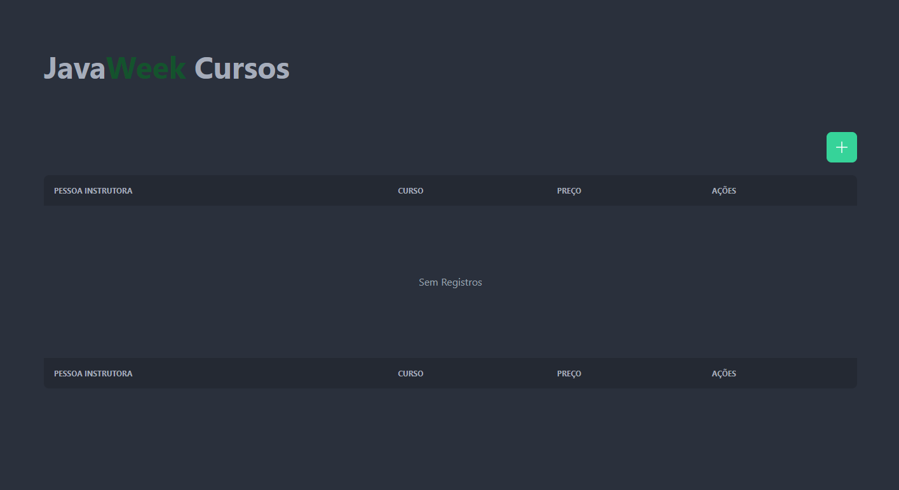
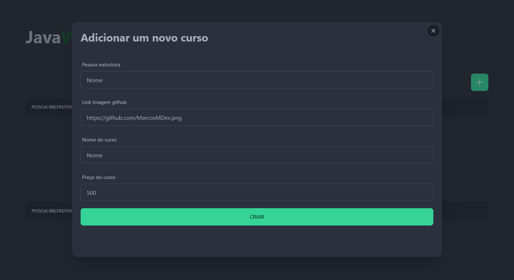
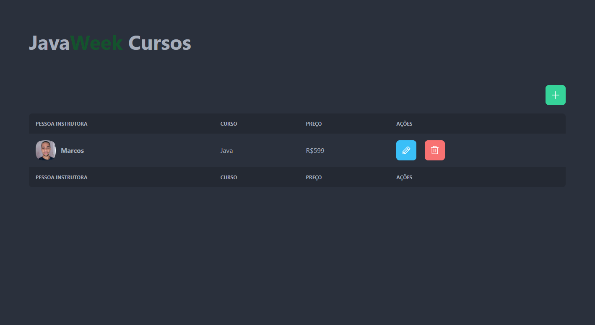
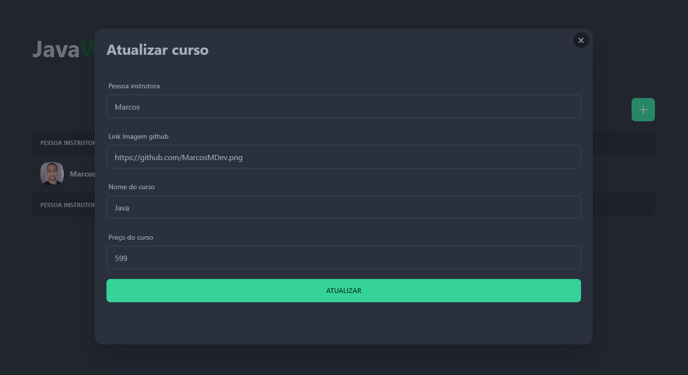

<h1 align='center'>
Java Week Frontend
</h1>

<h4 align='center'>
Projeto desenvolvido afim de consumir API criada na JavaWeek da LinuxTips🚀
</h4>
 
 # 🧪 Tecnologias

Esse projeto foi desenvolvido com as seguintes principais tecnologias:
- [ReactJS](https://pt-br.reactjs.org/);
- [ViteJS](https://vitejs.dev/);
- [Typescript](https://www.typescriptlang.org/);
- [Context API](https://pt-br.reactjs.org/docs/context.html);
- [React Router Dom](https://v5.reactrouter.com/web/guides/quick-start);
- [React Hook Form](https://react-hook-form.com/);
- [TailwindCSS](https://tailwindcss.com/);
- [Zod](https://github.com/colinhacks/zod);

# 🚀 Como executar

Clone o projeto e acesse a pasta do mesmo.

```bash
$ git clone https://github.com/MarcosMDev/java-week-frontend
$ cd java-week-frontend
```
Para iniciá-lo, siga os passos abaixo:
```bash
# Instalar as dependências
$ npm install
# Iniciar o projeto
$ npm run dev
```
O app estará disponível no seu browser pelo endereço http://localhost:5173.


# 🖼️ Imagens

<div align='center'>
  
  
  
  
</div>


# 📃 License
[MIT](https://choosealicense.com/licenses/mit/)<div align='center'>
